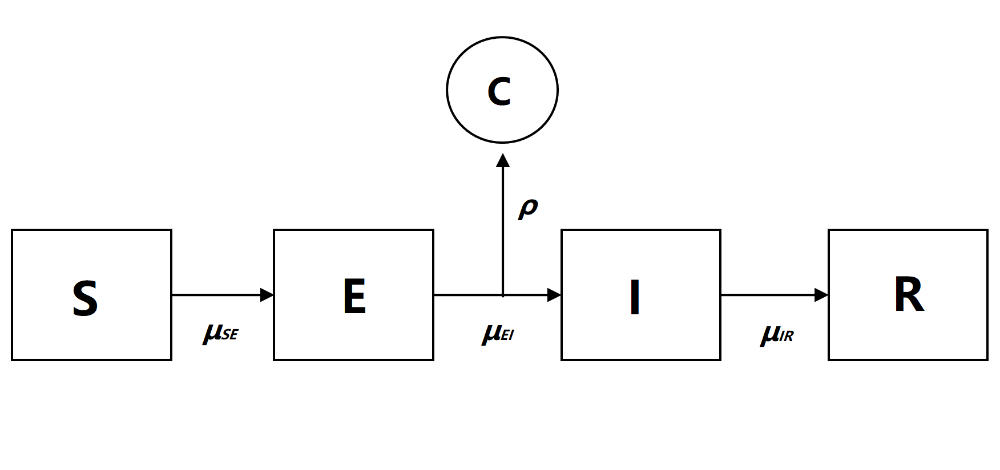
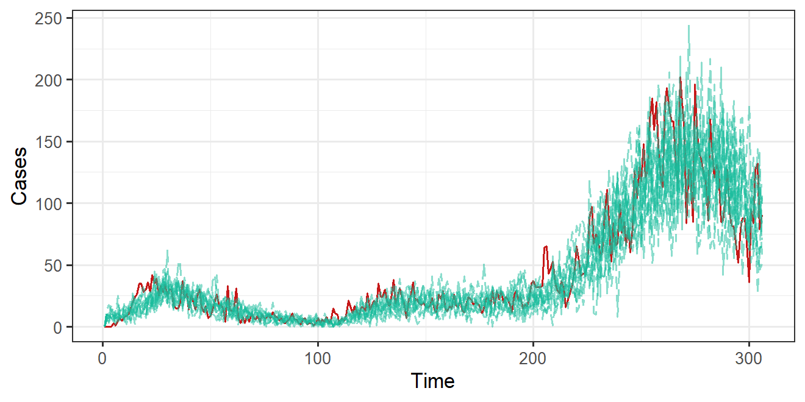

# An Analysis of COVID-19 Cases in Washtenaw County

STATS531 (WN21) final project. *[View full report.](http://raw.githack.com/longyyu/covid19-washtenaw/main/main.html)*

## Introduction

Since late 2019, the pandemic caused by the novel coronavirus COVID-19 has taken over the world and become the main focus for any concerned citizen. COVID-19 is extremely infectious, thought to spread from person to person mainly through close contact between individuals. This virus is commonly transmitted through droplets, which humans produce whenever they cough, sneeze, or exhale. Most infected patients have mild symptoms while some suffer from severe illness and even death. According to the statistics from [JHU](https://gisanddata.maps.arcgis.com/apps/opsdashboard/index.html#/bda7594740fd40299423467b48e9ecf6), by far, the global cumulative cases are 141,819,360, including 3,027,353 death and 81,118,986 recovery. 

The objective of this project is to conduct an analysis of Washtenaw County, Michigan reported COVID-19 cases with a Susceptible-Exposed-Infection-Recovered (SEIR) compartment model. Through model simulation and analysis, we want to gain understanding and stem the spread of COVID-19. We also set up a baseline ARMA model, using log-likelihood as the selection criterion, to see if our SEIR model can explain additional features of the data that the ARMA model is unable to capture.  

## Outline

* extend the SEIR framework to fit multiple waves of COVID by adopting a time-varying contact rate
* use iterative filterings to search locally and then globally for the maximum likelihood estimates (MLE) of the model parameters
* perform a likelihood benchmark analysis to compare the performance of the mechanistic SEIR model with non-mechanistic models

## Summary of Results

* The modified SEIR model with a time-varying contact rate is able to capture the multiple peaks of the reported COVID-19 cases and create satisfactory simulations. 
* The mechanistic SEIR model outperforms the negative binomial benchmark, and is competitive with the ARMA benchmark. 
* The performance of the SEIR model might be improved if the strong weekly pattern in the data can be accounted for. 
  

